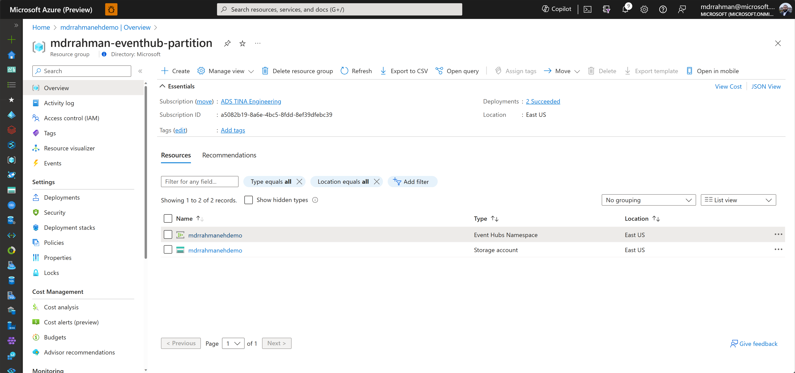
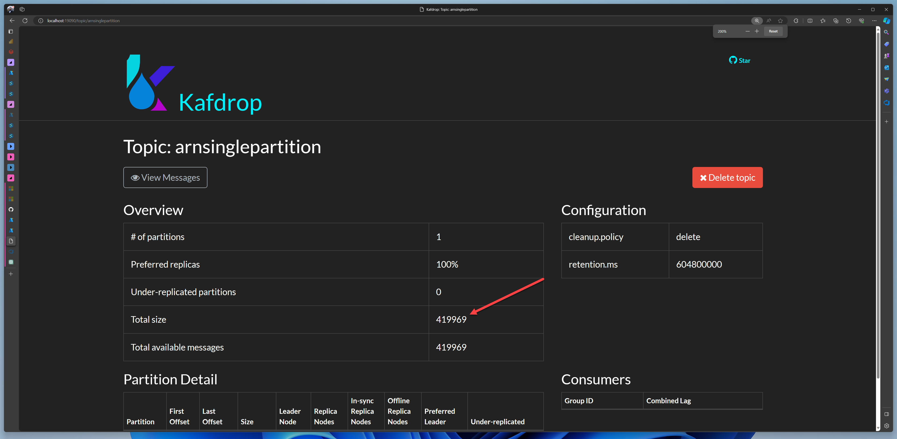

# Event-hub-partitioner

A demo project to showcase Event Hub Partitioning benefits for parallelization of work.

<!-- TOC depthfrom:2 -->

- [Infra setup](#infra-setup)
- [CompetingConsumerDemo for ARN Auto-onboarding Worker parallelization](#competingconsumerdemo-for-arn-auto-onboarding-worker-parallelization)
    - [Getting started](#getting-started)
- [ArnPartitionReplicator replicates westeurope ARN EH into Partitions](#arnpartitionreplicator-replicates-westeurope-arn-eh-into-partitions)
    - [Getting started](#getting-started)
    - [Consume from Spark](#consume-from-spark)
        - [Results](#results)
            - [Partition](#partition)
            - [Partition - 3 Spark Executors](#partition---3-spark-executors)

<!-- /TOC -->

## Infra setup

1 Event Hub Namespace and Blob Storage Account:



The Event Hub can be 18 TU, with 40 TU Burst:


Create 3 event hubs for the Demo Part 1 and Part 2:


Create a checkpoint container called `offsetcontainer`:


## `CompetingConsumerDemo` for ARN Auto-onboarding Worker parallelization

> This project was forked from [this repo](https://github.com/ciaranodonnell/AzureDemos/tree/master/AzureEventHubs/CompetingConsumersOnEventHub/Solution1), and from this [excellent demo video](https://www.youtube.com/watch?v=T4X_RTkgz40).

A single Producer, multi-Consumer setup to clearly showcase Event Hub re-balancing of Partition ownership within a Consumer Group.

### Getting started

1. Open in Visual Studio
2. Fill up `launchSettings.json`

```json
{
  "profiles": {
    "CompetingConsumerDemo": {
      "commandName": "Project",
      "environmentVariables": {
        "EH_CONN_STRING": "Endpoint=sb://mdrrahmanehdemo.servicebus.windows.net/;SharedAccessKeyName=RootManageSharedAccessKey;SharedAccessKey=H2...",
        "BLOB_CONN_STRING": "DefaultEndpointsProtocol=https;AccountName=mdrrahmanehdemo;AccountKey=MoK1...;EndpointSuffix=core.windows.net"
      }
    }
  }
}
```

3. Run in Visual Studio, a single Producer and Consumer will pop up. That Consumer will be assigned all 4 partitions by Event Hub within that Consumer Group:


4. Type `up` in the Producer window, to scale up more Consumers. Watch as Event Hub auto-distributes the Partitions to these new consumers.


Our Event Hub has 4 partitions. If you spin up a 5th consumer, watch as it won't receive any data:


> In other words, we see that Event Hub auto-distributes available Partitions within all Consumers in a given Consumer Group. As more workers are thrown into the Consumer Group, the faster the processing happens. For things like Auto-onboarding, this means we can have more workers part of the same Consumer Group to distribute the work.


## `ArnPartitionReplicator` replicates `westeurope` ARN EH into Partitions

This is a workaround project that takes ARN EH data, and pumps it into 2 identical event hubs - 1 is partitioned 32 times, the other is partitioned 0 times.

The idea is to showcase the effect of partitionining on Spark Consumption.

### Getting started

1. Open in Visual Studio
2. Fill up `launchSettings.json`

```json
{
  "profiles": {
    "ArnPartitionReplicator": {
      "commandName": "Project",
      "environmentVariables": {
        "SRC_EH_CONN_STRING": "Endpoint=sb://....servicebus.windows.net/;SharedAccessKeyName=RootManageSharedAccessKey;SharedAccessKey=...",
        "DEST_EH_CONN_STRING": "Endpoint=sb://mdrrahmanehdemo.servicebus.windows.net/;SharedAccessKeyName=RootManageSharedAccessKey;SharedAccessKey=H2...",
        "OFFSET_BLOB_CONN_STRING": "DefaultEndpointsProtocol=https;AccountName=mdrrahmanehdemo;AccountKey=Mo...;EndpointSuffix=core.windows.net"
      }
    }
  }
}
```

3. Run in Visual Studio, the app will basically read from the ARN Production (unpartitioned) Event Hub, and replicate to 2 Event Hubs - one partitioned, one unpartitioned.
4. Run it overnight to get a decent amount of data in the Event Hub:



### Consume from Spark

> The full runnable code is stored in the GCI [Synapse Workspace here](https://ms.web.azuresynapse.net/authoring/analyze/notebooks/1_eventhub?workspace=%2Fsubscriptions%2F68fa0545-661c-4152-93f2-fc8ae1c231b8%2FresourceGroups%2Fmonitoring-ci%2Fproviders%2FMicrosoft.Synapse%2Fworkspaces%2Fmonitoring-test-synapse&livyId=22&sparkPoolName=Large34)

Here's the summarized Ingestion Code:

```scala
// Contains all configuration
//
var config = Map[String, String]()

// ======================================================================
// =========================== DELTA TABLES =============================
// ======================================================================
config += ("database" -> "arn_snapshot_db_eh")
config += ("mount_point" -> s"/synapse/workspaces/monitoring-test-synapse")
config += ("checkpoint_path" -> s"${config("mount_point")}/checkpoints/${config("database")}")
config += ("table_prefix" -> "bronze_snapshot")

// ======================================================================
// =========================== EVENT HUBS =============================
// ======================================================================

// Change this Connection String to consume from the single partition vs 32 partition
//
var westeuropeEhConfig = EventHubsConf("Endpoint=sb://mdrrahmanehdemo.servicebus.windows.net/;SharedAccessKeyName=listen-events-policy;SharedAccessKey=...;EntityPath=arnsinglepartition")
                            .setStartingPosition(EventPosition.fromStartOfStream)
                            .setMaxEventsPerTrigger(16000)
                            .setPrefetchCount(8000)
                            .setMaxRatePerPartition(100000)
                            .setThreadPoolSize(16)

val region = "westeurope"

// Raw from Event Hub
//
val bronze_arn_DF = spark.readStream
  .format("eventhubs")
  .options(westeuropeEhConfig.toMap)
  .load()
  .withColumn("bronzeIngestTime", current_timestamp())
  .withColumn("region", lit(region))

// DeSer body to JSON
//
var parsed_top_DF = bronze_arn_DF
                        .selectExpr("sequenceNumber", "enqueuedTime", "CAST(body AS STRING)", "region", "bronzeIngestTime")
                        .withColumnRenamed("sequenceNumber", "offset")
                        .withColumn("body_array", from_json(col("body"), arnTopLevelSchema))
                        .drop("body")
                        .select($"*", explode($"body_array").alias("arnpayload"))
                        .selectExpr("*", "arnpayload.*")
                        .withColumn("eventTime", col("eventTime").cast("timestamp"))
                        .withColumn("eventTypeLower", lower(col("eventType")))
                        .drop("eventType")
                        .withColumnRenamed("eventTypeLower", "eventType")
                        .withColumn("eventTime_year", year($"eventTime"))
                        .withColumn("eventTime_month", month($"eventTime"))
                        .withColumn("eventTime_day", dayofmonth($"eventTime"))
                        .selectExpr("offset", "eventTime", "eventTime_year", "eventTime_month", "eventTime_day", "bronzeIngestTime", "id", "subject", "eventType", "dataVersion", "metadataVersion", "topic", "data", "region")

// Filter both events of interest
//
parsed_top_DF = parsed_top_DF
                      .filter(lower(col("eventType")) === "microsoft.hybridcompute/machines/extensions/snapshot" || lower(col("eventType")) === "microsoft.hybridcompute/machines/snapshot")
                      .select($"*", from_json(col("data"), microsoft_resourcegraph_snapshot_common_schema).as("data_temp"))
                      .drop("data")
                      .withColumnRenamed("data_temp", "data")

val bronze_snapshot_DF = parsed_top_DF
                      .select(flattenStructSchema(parsed_top_DF.schema): _*)

// Writing to individual Delta Tables significantly increases write performance
//
val individualDeltaTableToStream = s"${config("table_prefix")}_${region}"

val bronze_snapshot_Stream = bronze_snapshot_DF.writeStream
  .configureDeltaStreamOptions
  .partitionBy("eventType", "eventTime_year")
  .outputMode("append")
  .option("checkpointLocation", s"${config("checkpoint_path")}/${individualDeltaTableToStream}")
  .queryName(individualDeltaTableToStream)
  .trigger(Trigger.ProcessingTime("0 seconds"))
  .toTable(individualDeltaTableToStream)

spark.streams.awaitAnyTermination()
```

#### Results

##### 1 Partition

> About `1.5 K/sec`


##### 32 Partition - 3 Spark Executors

> About `4.5 K/sec`


> In other words, with more partitions, the more workers we throw at the cluster, in this case 3 Executors, we get more parallelism.